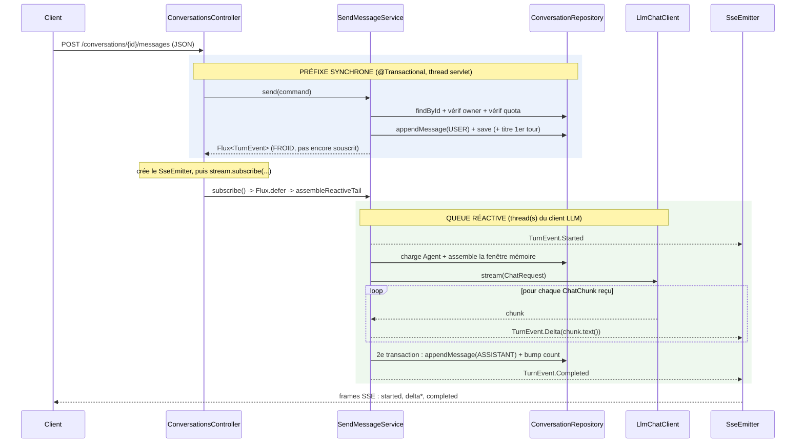

# Envoi d'un message et streaming de la réponse LLM (mode réactif)

Explication du chemin d'exécution déclenché par
`POST /conversations/{conversationId}/messages`, du contrôleur REST jusqu'à
l'appel du LLM et la réception de sa réponse en streaming.

---

## 1. L'idée générale : un préfixe synchrone + une queue réactive

Le traitement se coupe en **deux phases nettement séparées** :

| Phase | Où | Ce qu'elle fait | Transaction |
|-------|----|-----------------|-------------|
| **Préfixe synchrone** | corps de `SendMessageService.send(...)` | charge/vérifie la conversation, contrôle le quota, persiste le message USER, dérive le titre | dans le `@Transactional` de `send` |
| **Queue réactive** | `assembleReactiveTail(...)`, dans un `Flux` *froid* | émet `Started`, appelle le LLM en streaming, transforme chaque morceau en `Delta`, persiste le message ASSISTANT, émet `Completed` | 2ᵉ transaction (`TransactionTemplate`) |

Cette découpe est volontaire : tout ce qui peut **échouer avant** d'ouvrir le
flux (quota atteint, mauvais propriétaire, 404, LLM non configuré) est levé
comme exception **avant** que le `SseEmitter` ne soit créé. Spring traduit alors
l'exception en `application/problem+json` (HTTP 4xx/5xx) et **le flux SSE n'est
jamais ouvert**. Une fois le flux ouvert, on est en HTTP 200 et les erreurs se
signalent différemment (voir §7).

---

## 2. Diagramme de séquence



---

## 3. Réception dans le contrôleur

`ConversationsController.sendMessage(...)` est mappé ainsi :

```java
@PostMapping(
    value    = "/conversations/{conversationId}/messages",
    produces = MediaType.TEXT_EVENT_STREAM_VALUE,   // text/event-stream (SSE)
    consumes = MediaType.APPLICATION_JSON_VALUE)    // JSON en entrée
public SseEmitter sendMessage(...) { ... }
```

Le contrôleur **renvoie un `SseEmitter`** (API Spring MVC / servlet, pas
WebFlux). C'est le pont qui permet d'écrire des données au client de façon
asynchrone, au fil de l'eau.

### 3.1 Le préfixe synchrone est exécuté immédiatement

```java
SendMessageCommand command = new SendMessageCommand(
        ConversationOwner.from(principal),          // dispatch du Principal scellé
        new ConversationId(conversationId),
        new MessageContent(request.content()));
Flux<TurnEvent> stream = sendMessageUseCase.send(command);
```

Point clé : **l'appel `send(command)` exécute d'abord tout le corps synchrone**
de la méthode (voir §4). Ce n'est *que la queue réactive* qui est différée. Donc
au retour de `send`, le message USER est déjà persisté et validé ; les
exceptions éventuelles ont déjà été levées ici.

### 3.2 Création de l'émetteur et souscription

```java
long timeoutMs = properties.streaming().emitterTimeout().toMillis();
SseEmitter emitter = new SseEmitter(timeoutMs);
String instance = httpRequest.getRequestURI();

Disposable subscription = stream.subscribe(
        event -> writeFrameSafely(emitter, event),                 // onNext
        error -> writeErrorFrameAndComplete(emitter, error, instance), // onError
        emitter::complete);                                        // onComplete
```

C'est **ce `subscribe(...)` qui démarre réellement le traitement réactif**
(le `Flux` était froid). À partir de là :

- chaque `TurnEvent` émis est écrit en frame SSE via `writeFrameSafely` ;
- une erreur réactive est traduite en frame `error` via `writeErrorFrameAndComplete` ;
- la complétion du flux ferme l'émetteur (`emitter.complete()`).

### 3.3 Hooks d'annulation

```java
emitter.onCompletion(subscription::dispose);
emitter.onTimeout(subscription::dispose);
emitter.onError(t -> subscription.dispose());
```

Si le client se déconnecte (Tomcat déclenche `onCompletion`) ou si le timeout
est atteint (`onTimeout`), on **`dispose()`** la souscription Reactor.
L'annulation se propage en amont **jusqu'au client HTTP réactif OpenAI**, qui
coupe la connexion sortante : on n'attend plus une génération inutile.

---

## 4. Le préfixe synchrone dans `SendMessageService.send`

```java
@Override
@Transactional
public Flux<TurnEvent> send(SendMessageCommand command) {

    // 0) Échec rapide si aucun provider LLM configuré -> 500 (misconfiguration)
    if (llmChatClient.isEmpty()) {
        throw new IllegalStateException("LLM provider is not configured ...");
    }

    // 1) Charger + vérifier la conversation
    Conversation conversation = conversationRepository.findById(command.conversationId())
            .orElseThrow(() -> new ConversationNotFoundException(command.conversationId()));
    if (!conversation.owner().equals(command.owner())) {
        throw new ConversationNotFoundException(command.conversationId()); // 404, pas 403 (existence hiding)
    }
    if (conversation.messageCount().isFull()) {
        throw new ConversationFullException(command.conversationId());     // 409 (cap 64 messages)
    }

    // 2) Persister le message USER
    Message userMessage = new Message(new MessageId(UUID.randomUUID()),
            command.conversationId(), MessageRole.USER, command.content(), now);
    conversationRepository.appendMessage(userMessage);

    // 3) Dériver le titre au tout premier tour (si absent)
    // 4) save(afterUser)

    // 5) Figer (snapshot) les valeurs pour la queue réactive
    final ConversationId convId       = command.conversationId();
    final UUID           userMessageId= userMessage.id().value();
    final String         titleOrNull  = ...;
    final var            owner        = command.owner();
    final var            agentId      = afterUser.agentId();

    // 6) Retour d'un Flux FROID -> le corps ci-dessus est déjà exécuté,
    //    seul le lambda ci-dessous est différé jusqu'à la souscription.
    return Flux.defer(() -> assembleReactiveTail(
            convId, userMessageId, titleOrNull, owner, agentId));
}
```

Deux subtilités importantes :

1. **`@Transactional` s'applique à l'invocation de méthode.** La transaction
   est ouverte au début de `send` et **committée au retour** — donc *avant* que
   le contrôleur ne souscrive. Le message USER est donc committé indépendamment
   de la réussite du tour LLM. La réponse ASSISTANT sera persistée dans une
   **seconde** transaction (les callbacks réactifs s'exécutent hors du proxy
   transactionnel).

2. **Snapshot des variables (`final`).** La queue réactive peut s'exécuter sur
   un autre thread (event loop du client HTTP). On copie donc les valeurs
   nécessaires dans des variables locales `final` plutôt que de relire l'état
   mutable du service parent depuis les callbacks.

---

## 5. La queue réactive : `assembleReactiveTail`

C'est ici que le message part vers le LLM et que la réponse est reçue morceau
par morceau. La méthode compose un `Flux<TurnEvent>` en 4 étapes.

### Étape 1 — Émettre `Started` en premier

```java
Mono<TurnEvent> startedMono = Mono.just(
        (TurnEvent) new TurnEvent.Started(userMessageId, convId.value()));
```

Le contrat (`TurnEvent`) garantit que le **premier** élément d'un tour réussi
est exactement un `Started`. En le plaçant en tête, même si une étape ultérieure
échoue, le client voit `Started → Error` — **jamais zéro frame**.

### Étape 2 — Construire la `ChatRequest` **paresseusement**

```java
StringBuilder accumulated = new StringBuilder();

Mono<ChatRequest> requestMono = Mono.fromCallable(() -> {
    Agent agent = agentRepository.findById(agentId)
            .orElseThrow(() -> new AgentNotFoundException(agentId));
    var window = memoryWindowAssembler.assemble(convId, agent.memorySize());
    if (owner instanceof ConversationOwner.UserOwner u) {
        chatTurnContext.enter(agentId, u.userId());   // contexte pour le tool DelegateTool
    }
    return chatRequestBuilder.build(agentId, owner, window);
});
```

- `Mono.fromCallable(...)` = le code est évalué **à la souscription**, donc
  *après* l'émission de `Started`. Toute erreur de construction (agent
  introuvable, etc.) part par `onError` du Reactor, jamais synchrone.
- La **fenêtre mémoire** (`memoryWindowAssembler.assemble`) reconstitue
  l'historique de la conversation borné par `agent.memorySize()` : c'est le
  contexte conversationnel envoyé au LLM avec le nouveau message USER.
- `chatRequestBuilder.build(...)` assemble la requête finale (prompt système,
  historique, message courant, outils…).

### Étape 3 — Streamer depuis le LLM et mapper chaque morceau en `Delta`

```java
Flux<TurnEvent> deltasAndCompleted = requestMono.flatMapMany(request ->
    llmChatClient.get().stream(request)                       // Flux<ChatChunk>
        .doOnNext(chunk -> accumulated.append(chunk.text()))  // on accumule le texte complet
        .<TurnEvent>map(chunk -> new TurnEvent.Delta(chunk.text())) // chunk -> Delta
        .concatWith(Mono.fromCallable(() ->                   // à la fin du flux LLM :
            persistAssistantAndBuildCompletedEvent(           // persiste ASSISTANT + émet Completed
                convId, accumulated.toString(), titleOrNull))));
```

C'est le cœur de la **réception de la réponse** :

- `llmChatClient.get().stream(request)` renvoie un `Flux<ChatChunk>` : le LLM
  répond en flux, un `ChatChunk` par fragment de texte généré.
- `flatMapMany` : à partir de l'unique `ChatRequest`, on produit le flux
  d'événements (une seule requête → pas d'entrelacement à craindre).
- `doOnNext` : **effet de bord** — on accumule `chunk.text()` dans le
  `StringBuilder` pour reconstituer la réponse complète (nécessaire pour la
  persistance finale).
- `map` : **transformation** — chaque `ChatChunk` devient un `TurnEvent.Delta`
  que le contrôleur écrira en frame SSE. C'est le streaming vu par le client.
- `concatWith(...)` : **une fois le flux LLM terminé**, on exécute la
  persistance de la réponse ASSISTANT et on émet l'unique `Completed`.

### Étape 4 — Composer et nettoyer

```java
return startedMono.concatWith(deltasAndCompleted)
        .doOnCancel(() -> log.debug("chat turn cancelled ... convId={}", convId.value()))
        .doFinally(signal -> chatTurnContext.clear());   // nettoie le contexte sur tout signal terminal
```

- `concatWith` **préserve l'ordre** : `Started`, puis `Delta*`, puis
  `Completed` — exactement le contrat de `TurnEvent`.
- `doFinally` garantit que le `ChatTurnContext` est vidé sur **toute** fin
  (succès, erreur *ou* annulation).

---

## 6. Persistance de la réponse ASSISTANT (2ᵉ transaction)

```java
private TurnEvent persistAssistantAndBuildCompletedEvent(
        ConversationId convId, String accumulatedText, String titleOrNull) {
    return transactionTemplate.execute(status -> {          // <-- SECONDE transaction
        String content = accumulatedText.isEmpty() ? " " : accumulatedText;
        Message assistant = new Message(new MessageId(UUID.randomUUID()),
                convId, MessageRole.ASSISTANT, new MessageContent(content), now);
        conversationRepository.appendMessage(assistant);

        Conversation reloaded = conversationRepository.findById(convId)
                .orElseThrow(() -> new ConversationNotFoundException(convId));
        Conversation saved = reloaded.incrementMessageCount(now)
                             /* .save(...) */;

        return new TurnEvent.Completed(
                assistant.id().value(),
                titleOrNull,                        // non-null seulement au 1er tour
                saved.messageCount().value());      // compteur à jour
    });
}
```

Pourquoi un `TransactionTemplate` et pas `@Transactional` ? Parce que ce
callback **s'exécute en dehors** de l'invocation de `send()` (souvent sur un
autre thread), donc hors du proxy transactionnel de Spring. On ouvre donc
explicitement une transaction ici.

À noter : `MessageContent` refuse le blanc ; une réponse assistant vide (rare)
devient un espace pour satisfaire l'invariant, et le frame vide correspondant
est de toute façon élidé par l'écrivain SSE.

---

## 7. Le port LLM et la gestion des erreurs

### `LlmChatClient` (port agnostique du provider)

```java
public interface LlmChatClient {
    ChatResult      call(ChatRequest request);    // non-streaming
    Flux<ChatChunk> stream(ChatRequest request);  // streaming (utilisé ici)
}
```

Contrat important : les implémentations **doivent** propager les échecs
provider via `Flux.error(...)` dans la chaîne réactive, **et non** en levant une
exception synchrone. La frontière REST mappe `LlmUnavailableException` en
**HTTP 502 `LLM_UNAVAILABLE`**.

### Deux régimes d'erreur bien distincts

| Moment de l'erreur | Émetteur ouvert ? | Traitement | Statut HTTP |
|--------------------|-------------------|------------|-------------|
| **Préfixe synchrone** (avant `subscribe`) | Non | exception hors de `send` → handler global → `application/problem+json` | 4xx / 5xx |
| **Queue réactive** (après `Started`) | Oui (headers déjà flushés) | `writeErrorFrameAndComplete` → `SseErrorTranslator` → frame SSE `error` | reste **200** |

C'est pour cela que `TurnEvent.Error` existe mais que **le use case ne l'émet
jamais** : en cas d'échec réactif il signale `Flux.error(...)`, et c'est
l'adaptateur REST qui construit la frame `error` via le même code que le handler
d'exceptions synchrones.

---

## 8. La particularité de `Disposable` dans ce code

```java
Disposable subscription = stream.subscribe(
        event -> writeFrameSafely(emitter, event),
        error -> writeErrorFrameAndComplete(emitter, error, instance),
        emitter::complete);
```

### Rôle central

Le `Disposable` renvoyé par `stream.subscribe(...)` est la pièce maîtresse du
mécanisme d'annulation du flux. `subscribe()` ne renvoie **pas** les données —
celles-ci arrivent de façon asynchrone via les trois callbacks (`onNext`,
`onError`, `onComplete`). Il renvoie un **handle vers la souscription active** :
le `Disposable`. Appeler `.dispose()` dessus annule la souscription et propage
un signal `cancel` en amont dans toute la chaîne réactive.

### Le pont entre deux mondes

Ce `Disposable` relie le cycle de vie du `SseEmitter` (côté HTTP/Tomcat) à celui
du flux LLM (côté Reactor), deux mondes qui ne se connaissent pas nativement :

```java
emitter.onCompletion(subscription::dispose);
emitter.onTimeout(subscription::dispose);
emitter.onError(t -> subscription.dispose());
```

- **Déconnexion client** → Tomcat déclenche `onCompletion` → `dispose()`
- **Timeout de l'emitter atteint** → Tomcat déclenche `onTimeout` → `dispose()`

Dans les deux cas, `dispose()` remonte le signal d'annulation à travers le
`Flux<TurnEvent>` du use case, jusqu'à l'adaptateur OpenAI et son client HTTP
réactif — ce qui **libère la connexion HTTP en amont** au lieu de continuer à
consommer un stream LLM dont plus personne ne veut (US-11-006 / REQ-STR-003).

### Subtilités

| Point | Détail |
|-------|--------|
| **Portée** | Le `Disposable` capture *cette souscription-ci*, pas le `Flux`. Le `Flux` est froid (`Flux.defer` dans le service) et re-souscriptible ; le handle ne concerne qu'une seule exécution. |
| **Symétrie bidirectionnelle** | Reactor → SSE : les callbacks écrivent des frames. SSE → Reactor : le `Disposable` annule le flux. |
| **Interface minimale** | `Disposable` n'expose que `dispose()` et `isDisposed()`, ce qui en fait une cible idéale pour les références de méthode `subscription::dispose`. |
| **Idempotence** | `dispose()` est idempotent : si plusieurs signaux terminaux se croisent (ex. timeout puis erreur), pas de double effet néfaste. |

### En résumé

Sans ce handle, une déconnexion client laisserait le stream LLM tourner dans le
vide jusqu'à sa fin naturelle — gaspillant ressources et coûts. Le `Disposable`
est le fil qui permet à l'annulation de remonter proprement toute la chaîne.

---

## 9. Pont Reactor → SSE : pourquoi pas un lien direct de type `Flux` ?

Oui, c'est bien un pont : le `Flux<TurnEvent>` (côté Reactor / Spring AI) est
ponté manuellement sur un `SseEmitter` (côté réponse HTTP). La raison de
l'absence de lien « direct » tient à **quelle stack Spring est utilisée ici**.

### Ce contrôleur tourne sur Spring MVC (servlet), pas WebFlux

Indices dans le code :

- `HttpServletRequest httpRequest` en paramètre → API Servlet
- `SseEmitter` importé de
  `org.springframework.web.servlet.mvc.method.annotation` → mécanisme SSE
  **de Spring MVC**, pas de WebFlux
- Tomcat mentionné dans les commentaires (`onCompletion`, `onTimeout`)

Dans le monde servlet, le conteneur (Tomcat) ne « comprend » pas nativement un
`Flux` comme corps de réponse en streaming. Le contrat de retour attendu pour du
SSE, c'est `SseEmitter` — un objet impératif sur lequel on pousse des frames.
D'où le pont manuel : on souscrit au `Flux` et, dans les callbacks, on écrit sur
l'emitter.

### Le lien direct existe... mais seulement en WebFlux

En **Spring WebFlux** (stack réactive, Netty), on pourrait écrire :

```java
@PostMapping(value = "/conversations/{id}/messages",
             produces = MediaType.TEXT_EVENT_STREAM_VALUE)
public Flux<ServerSentEvent<TurnEvent>> sendMessage(...) {
    return sendMessageUseCase.send(command)
            .map(evt -> ServerSentEvent.builder(evt).build());
}
```

Là, le framework souscrit lui-même au `Flux`, gère le backpressure de bout en
bout, et propage l'annulation automatiquement à la déconnexion du client. Pas
besoin de `Disposable` explicite ni de hooks `onTimeout`/`onCompletion`.

### Pourquoi rester sur MVC + le pont manuel ?

Plusieurs raisons, souvent cumulées :

1. **Le reste de l'application est en MVC.** Les autres endpoints (`GET`,
   `PATCH`, `DELETE`...) sont servlet/bloquants. Mélanger MVC et WebFlux dans un
   même contexte est possible mais délicat ; garder une seule stack est plus
   simple et prévisible.

2. **Le use case n'est réactif qu'en surface.** Dans `SendMessageService`, le
   préfixe (chargement conversation, vérif cap, persistance du message USER) est
   **synchrone et transactionnel** (`@Transactional`), et la persistance de la
   réponse ASSISTANT passe par un `TransactionTemplate` bloquant. Seule la partie
   streaming LLM est vraiment réactive. Un vrai WebFlux exigerait un accès données
   non-bloquant (R2DBC) de bout en bout — visiblement pas le cas ici (JPA/JDBC
   bloquant). Le `Flux` sert donc à modéliser le stream de tokens, pas à obtenir
   une chaîne 100 % non-bloquante.

3. **Le pont manuel donne un contrôle fin.** Besoins précis visibles dans le
   code : élision des deltas vides, traduction d'erreur en frame SSE `error` (via
   `SseErrorTranslator`) avec statut HTTP maintenu à 200 une fois les headers
   flushés, logging spécifique à l'annulation. Le pont rend ces comportements
   explicites et testables.

### En résumé

Le `Flux → SseEmitter` n'est pas un défaut mais une **adaptation d'impédance** :
un producteur réactif branché sur une stack web impérative. Le lien direct de
type `Flux` existe, mais suppose WebFlux de bout en bout — ce qui aurait imposé
de réécrire la couche persistance en non-bloquant pour un gain réel. Ici,
l'équipe a préféré garder MVC et payer le prix d'un petit adaptateur, dont le
`Disposable` est la pièce qui referme la boucle d'annulation.

---

## 10. Pourquoi un `.get()` sur `llmChatClient` ?

Le `.get()` ne porte pas sur l'interface `LlmChatClient` elle-même, mais sur l'`Optional` qui l'enveloppe.

Regarde la déclaration du champ dans `SendMessageService` :

```java
private final Optional<LlmChatClient> llmChatClient;
```

Le client n'est pas injecté directement comme `LlmChatClient`, mais comme `Optional<LlmChatClient>`. Donc `llmChatClient.get()` appelle `Optional.get()`, qui déballe l'`Optional` et retourne l'instance de `LlmChatClient` contenue — c'est sur cette instance qu'on chaîne ensuite `.stream(request)`.

**Pourquoi l'injecter comme `Optional` ?** Le Javadoc de la classe l'explique. Dans certains profils de test, l'autoconfiguration OpenAI de Spring AI est exclue (incompatibilité binaire Spring AI 1.1.0 / Spring 7), donc aucun bean `LlmChatClient` n'existe. En l'injectant comme `Optional`, le bean `SendMessageService` peut toujours être créé — tous les `@SpringBootTest` démarrent, même sans provider LLM configuré — tout en échouant proprement dès qu'un vrai tour de chat est tenté.

C'est ce que fait le garde en tête de `send(...)` :

```java
if (llmChatClient.isEmpty()) {
    throw new IllegalStateException(
            "LLM provider is not configured for this environment");
}
```

Une fois ce contrôle passé, on sait que l'`Optional` est présent, donc l'appel `llmChatClient.get()` dans la queue réactive est sûr : à ce stade, il ne peut pas lever de `NoSuchElementException`.

**En résumé :** `.get()` est bien la méthode de `Optional`, pas un membre de l'interface `LlmChatClient`. L'`Optional` sert à rendre la dépendance facultative au niveau de l'injection Spring, tout en la traitant comme obligatoire au moment de l'exécution d'un tour de chat.

---

## 11. Pourquoi utilise-t-on `flatMapMany` ?

`flatMapMany` sert ici à faire le pont entre un `Mono` en entrée et un `Flux` en sortie.

Regarde les types en jeu :

```java
Mono<ChatRequest> requestMono = Mono.fromCallable(() -> {...});
```

`requestMono` est un `Mono<ChatRequest>` : il produit au plus **un seul** élément, la `ChatRequest` construite paresseusement.

Mais à partir de cette unique requête, on veut émettre **plusieurs** `TurnEvent` : une suite de `Delta` (un par chunk du LLM) suivie d'un `Completed`. La lambda passée à `flatMapMany` retourne donc un `Flux<TurnEvent>` :

```java
llmChatClient.get().stream(request)   // Flux<ChatChunk>
        .map(chunk -> new TurnEvent.Delta(chunk.text()))   // Flux<TurnEvent>
        .concatWith(Mono.fromCallable(...))                // + le Completed
```

Le besoin est donc : partir d'un `Mono<ChatRequest>` et obtenir un `Flux<TurnEvent>`. C'est exactement le rôle de `flatMapMany`.

**Pourquoi pas `flatMap` ?** Sur un `Mono`, `flatMap` attend que la fonction retourne un `Mono` et produit un `Mono` en sortie — il est fait pour un enchaînement un-vers-un (ou un-vers-zéro-ou-un). Ici la fonction retourne un `Flux` qui émet potentiellement beaucoup d'éléments, donc `flatMap` ne conviendrait pas au niveau des types.

`flatMapMany` est précisément l'opérateur de `Mono` conçu pour ce cas : `Mono<T>` → `Flux<R>`. Il souscrit à la requête unique, applique la lambda, puis « aplatit » le `Publisher` retourné en émettant tous ses éléments dans le flux résultant.

En résumé, la mécanique du tour de chat est :

1. `startedMono` émet le `Started` en premier.
2. `deltasAndCompleted` déballe l'unique `ChatRequest`, ouvre le stream du LLM, et transforme cette requête unique en une séquence de `Delta` puis un `Completed` — d'où `flatMapMany`.
3. `startedMono.concatWith(deltasAndCompleted)` concatène le tout dans l'ordre garanti par le contrat (`Started` → `Delta*` → `Completed`).

**Un détail utile :** `flatMapMany` diffère aussi le calcul. Comme `requestMono` est lui-même un `Mono.fromCallable`, la construction de la `ChatRequest` (et les erreurs éventuelles, `AgentNotFoundException` par exemple) ne se produit qu'à la souscription, donc **après** l'émission du `Started`. C'est ce qui garantit que le client voit toujours `Started` avant une éventuelle erreur, jamais zéro frame.

---

## 12. Flux progressif. Role de concatWith
 Les événements sont envoyés **progressivement**, au fur et à mesure — on n'attend pas que toute la réponse du LLM soit terminée. C'est tout l'intérêt du streaming SSE ici. Mais il y a une nuance importante liée à `concat`, que je vais détailler.

### Le flux est bien progressif

Regarde la source des `Delta` :

```java
llmChatClient.get().stream(request)   // Flux<ChatChunk> — émission au fil de l'eau
        .doOnNext(chunk -> accumulated.append(chunk.text()))
        .<TurnEvent>map(chunk -> new TurnEvent.Delta(chunk.text()))
```

`stream(request)` retourne un `Flux<ChatChunk>` qui émet chaque chunk **dès que le provider le renvoie**. Chaque chunk est immédiatement transformé en `Delta` et propagé vers le subscriber (le `SseEmitter` du contrôleur), qui écrit une frame SSE. Le client reçoit donc le texte token par token, sans attendre la fin.

Il ne faut pas se laisser tromper par le `accumulated.append(...)` : ce `StringBuilder` accumule le texte **en parallèle** de l'émission, uniquement pour reconstituer la réponse complète au moment de persister le message ASSISTANT à la fin. L'accumulation ne bloque pas la propagation des `Delta`.

### Le rôle de `concat` (via `concatWith`)

Il y a en fait deux `concatWith` dans le code, avec le même rôle : **garantir l'ordre séquentiel** entre des sources.

`concat` souscrit à ses sources **l'une après l'autre** : il épuise complètement la première (jusqu'à son signal `onComplete`) avant de souscrire à la suivante. C'est ce qui préserve le contrat d'ordre des `TurnEvent` (`Started` → `Delta*` → `Completed`).

**Premier `concatWith`** — à la fin des deltas :

```java
llmChatClient.get().stream(request)
        .map(chunk -> new TurnEvent.Delta(chunk.text()))
        .concatWith(Mono.fromCallable(() ->
                persistAssistantAndBuildCompletedEvent(...)));
```

Ici `concat` garantit que le `Mono` qui persiste le message ASSISTANT et produit le `Completed` n'est souscrit **qu'après** le dernier `Delta`. C'est essentiel : la persistance a besoin de `accumulated.toString()`, donc du texte complet — elle ne doit s'exécuter qu'une fois tous les chunks reçus. `concat` fournit exactement cette garantie « d'abord tout le flux de deltas, ensuite la persistance ».

**Second `concatWith`** — au niveau de l'assemblage global :

```java
return startedMono.concatWith(deltasAndCompleted)
```

Là, `concat` garantit que le `Started` est émis **en premier**, avant que `deltasAndCompleted` ne soit souscrit. Et comme `deltasAndCompleted` part de `requestMono` (un `Mono.fromCallable`), la construction de la `ChatRequest` — donc l'appel au LLM — ne démarre qu'après l'émission du `Started`.

### Pourquoi `concat` et pas `merge` ?

C'est le point clé. `merge` souscrirait à toutes les sources **en même temps** et entrelacerait leurs émissions selon l'ordre d'arrivée — ce qui casserait le contrat : on pourrait voir un `Delta` avant le `Started`, ou tenter la persistance avant la fin des chunks. `concat` impose au contraire la séquentialité stricte.

En résumé : le streaming est bien progressif au niveau des `Delta`, et `concat` sert uniquement à ordonner les **frontières** entre phases (`Started` d'abord, puis les deltas au fil de l'eau, puis `Completed` une fois le flux épuisé). Il ne met pas en tampon les deltas et ne retarde pas leur envoi — il retarde seulement le passage à la phase suivante.

---

## 13. Flux froid et role de return

Le return ne fait qu'assembler et retourner un Flux froid. Aucun TurnEvent n'est émis à ce moment-là. Ce qu'on retourne, c'est une recette (une description du pipeline), pas des données en train de circuler.

```java
return startedMono.concatWith(deltasAndCompleted)
        .doOnCancel(...)
        .doFinally(...);
```

Cette ligne construit le graphe d'opérateurs et le rend. À cet instant, rien ne se passe : Flux.defer (dans send) et Mono.fromCallable (pour la requête) sont justement là pour que rien ne s'exécute avant la souscription. C'est le principe des publishers froids : ils sont paresseux.

Ce qui déclenche réellement l'émission : la souscription

Les TurnEvent commencent à circuler seulement quand quelqu'un souscrit au Flux. Et ce quelqu'un, c'est le contrôleur, dans sendMessage :

```java
Disposable subscription = stream.subscribe(
        event -> writeFrameSafely(emitter, event),   // chaque TurnEvent → frame SSE
        error -> writeErrorFrameAndComplete(...),
        emitter::complete);
```

C'est cet appel .subscribe(...) qui « allume » le pipeline. À partir de là, et seulement à partir de là :

startedMono émet le Started,
puis concat souscrit à deltasAndCompleted, ce qui construit la ChatRequest, ouvre le stream du LLM, et fait remonter les Delta un par un,
puis le Completed à la fin.
La distinction à retenir

Il y a donc deux moments distincts :

Au return (assemblage) : l'ordre est défini — c'est concat qui fige la séquence Started → Delta* → Completed dans la structure du pipeline. Mais rien n'est émis.
À la souscription (dans le contrôleur) : l'ordre défini plus haut est exécuté — les événements sont réellement produits et poussés vers le subscriber, progressivement.

Donc pour répondre précisément : l'ordre est décidé au moment du return (par la façon dont on compose avec concat), mais l'envoi effectif des TurnEvent se fait au moment de la souscription, dans stream.subscribe(...) du contrôleur — pas au return.

C'est d'ailleurs pour ça que le contrôleur peut brancher ses callbacks (writeFrameSafely, gestion d'erreur, complete) et ses hooks d'annulation (onCompletion, onTimeout) avant que quoi que ce soit ne parte : au moment où il souscrit, tout est prêt à recevoir le flux.

---

## Annexe. Récapitulatif des points « réactifs » à retenir

1. **Flux froid + `Flux.defer`** : rien de la queue réactive ne s'exécute avant
   la souscription du contrôleur. Le préfixe synchrone, lui, s'exécute
   immédiatement dans le corps de `send`.
2. **La souscription est explicite** dans le contrôleur (`stream.subscribe(...)`),
   et fait le pont Reactor → `SseEmitter`.
3. **Ordre garanti** par `concatWith` : `Started → Delta* → Completed`.
4. **Threading** : la queue peut tourner sur les threads du client HTTP réactif,
   d'où le snapshot des variables `final` et la 2ᵉ transaction via
   `TransactionTemplate`.
5. **Annulation propagée** : `dispose()` sur déconnexion/timeout coupe l'appel
   LLM en amont (`onCompletion`/`onTimeout`/`onError`).
6. **Deux transactions** : USER dans le `@Transactional` de `send` (committée
   avant le streaming), ASSISTANT dans une transaction séparée à la fin du flux.
7. **Deux régimes d'erreur** selon que le flux SSE est déjà ouvert ou non.